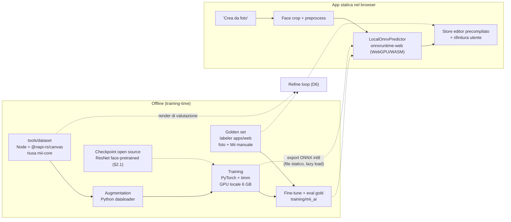

# Piano di sviluppo — Foto → Mii (AI v0)

Documento di esecuzione dettagliato per lo **Step 2** di `MII_BUILDER_PLAN.md` (§4): il modello
locale che, data una foto, produce i parametri di un Mii compatibile con `mii-core`.

- **Data:** 2026-09-17
- **Revisione:** 4 (2026-09-19) — **labeler del golden set (D0.7, parte web) implementato**:
  `apps/web/labeler.html` + `apps/web/src/labeler/`, pagina Vite separata ed esclusa dalla build di
  produzione, riuso di store/`FieldRenderer`/`MiiPreview` dell'editor, salvataggio `.mii` su disco
  (File System Access API, fallback download), seconda passata `.p2.mii`, note di salto esportabili.
  Restano del D0.7: validator CLI (`gold validate`), 50 coppie e accordo umano-umano
- **Revisione 3 (2026-09-19):** si parte da **modelli open source esistenti**: prior art `mii2attr`
  (§2.1), init **ResNet face-pretrained** (§8.1), quantizzazione QDQ statica (§11.1)
- **Revisione 2:** integrazione del golden set (§5, §9), validazione gold (§7.4), documenti in `docs/`
- **Riferimenti:** `MII_BUILDER_PLAN.md` §4, `MII_FORMAT_RESEARCH.md`, `packages/mii-core`,
  ricerca prior art 2026-09-19 (§2.1)
- **Stato del repo:** Step 1 completo (codec, tabelle, renderer 2D, editor). **Labeler D0.7
  implementato il 2026-09-19** (`apps/web`, pagina esclusa dalla build di produzione). Zero codice AI.
- **Decisioni prese (2026-09-17):**
  1. Training su **GPU locale** — NVIDIA RTX 4050 Laptop 6 GB, compute 8.9 (Ada), driver 610.88
  2. Primo traguardo = **dataset + modello v0 in Python** con metriche; browser dopo
  3. **Foto reali disponibili** (consenzienti) per valutazione qualitativa e golden set
  4. Il codice di training vive in **`training/`** dentro il repo
  5. **Golden set (foto, Mii fatto a mano): 50 coppie** — la ground truth umana del progetto,
     usata per la validazione onesta (top-1 contro le scelte di una persona) e per il fine-tuning
     (D3.5). Il **labeler** è una pagina separata in `apps/web`, esclusa dalla build di produzione,
     con i picker dell'editor: zero duplicazione. Accordo umano-umano misurato su 8 foto. Lo
     pseudo-labeling VLM (§10.3) è declassato a **piano B**.
  6. **Non-obiettivi di questa v0:** renderer 3D, formato CHARINFO/Switch, backend, deploy pubblico.
  7. **Si parte da modelli open source esistenti (2026-09-19):** (a) come pipeline di riferimento
     `mzltest/miiak` (mii2attr), che risolve lo stesso problema invertendo il renderer FFL con 34
     teste — le sue scelte di design si adottano (§2.1); (b) come inizializzazione un backbone
     **ResNet face-pretrained** (FairFace ResNet-34 di default), **non** ImageNet generico né training
     da zero (§8.1). ImageNet e random restano solo come baseline di ablation.
  8. **Quantizzazione int8 statica (QDQ) con calibrazione**, non dinamica (§11.1): è la modalità
     raccomandata per i CNN e necessaria se in futuro si tornasse a backbone depthwise.

---

## Indice

1. [Scope e aspettative](#1-scope-e-aspettative)
2. [Architettura della pipeline](#2-architettura-della-pipeline)
3. [Prerequisiti e setup ambiente](#3-prerequisiti-e-setup-ambiente)
4. [D0 — `tools/dataset`](#4-d0--toolsdataset)
5. [D0.7 — Golden set (foto, Mii fatto a mano)](#5-d07--golden-set-foto-mii-fatto-a-mano)
6. [D1 — Scheletro `training/` e sanity check](#6-d1--scheletro-training-e-sanity-check)
7. [D2 — Harness di valutazione](#7-d2--harness-di-valutazione)
8. [D3 — Training v0](#8-d3--training-v0)
9. [D3.5 — Fine-tuning sul golden set](#9-d35--fine-tuning-sul-golden-set)
10. [D4 — Valutazione su foto reali e domain gap](#10-d4--valutazione-su-foto-reali-e-domain-gap)
11. [D5 — Export ONNX e integrazione app](#11-d5--export-onnx-e-integrazione-app)
12. [D6 — Refine loop (rinviato)](#12-d6--refine-loop-rinviato)
13. [Milestone, DoD e stime](#13-milestone-dod-e-stime)
14. [Rischi](#14-rischi)
15. [Decisioni aperte](#15-decisioni-aperte)
16. [Appendice A — Schema `params.jsonl`](#appendice-a--schema-paramsjsonl)
17. [Appendice B — Teste di training](#appendice-b--teste-di-training)
18. [Appendice C — Comandi](#appendice-c--comandi)
19. [Appendice D — Definition of Done v0](#appendice-d--definition-of-done-v0)
20. [Appendice E — Schema `gold_pairs.jsonl` e accordo](#appendice-e--schema-gold_pairsjsonl-e-accordo)

---

## 1. Scope e aspettative

### 1.1 Il problema reale

Non esistono coppie (foto, Mii) nel mondo: nessun dataset pubblico, nessuna ground truth umana
su larga scala. L'unica strada praticabile per il training è **costruire il dataset al contrario**:

```
Mii campionato → render 2D → (augmentation) → modello impara l'inversione → params
```

Il modello quindi impara a invertire un renderer, non a capire le persone. Il domain gap
render cartoon ↔ foto reale è **il** problema del progetto; augmentation, metrica end-to-end e
refine loop esistono per ridurlo, non per eliminarlo.

Questo approccio "closed-loop" non è un'ipotesi: il progetto open source **`mzltest/miiak`**
(mii2attr) lo ha già implementato sullo stesso formato Mii con un renderer autentico (FFL), 34
teste e un backbone ResNet/ConvNeXt. La strada è validata; ciò che resta originale qui è il
renderer 2D, il golden set e la valutazione onesta (§2.1).

L'unico riferimento umano disponibile è un piccolo **golden set** di coppie (foto consenziente,
Mii costruito a mano) (§5). Con 50 coppie non si addestra un modello da zero — si valuta
onestamente e si fa fine-tuning — ma è la metrica di prodotto che conta: l'accordo con le scelte
di una persona è il soffitto misurabile del progetto.

### 1.2 Cosa il modello predice

**Tratti visivamente deducibili da un volto:**

| Gruppo | Campi |
|---|---|
| Identità globale | `sex`, `skinTone`, `faceType` |
| Capelli | `hair.type`, `hair.color`, `hair.flip` |
| Sopracciglia | `eyebrow.type`, `eyebrow.color`, `eyebrow.rotation` |
| Occhi | `eye.type`, `eye.color` |
| Accessori | `glasses.type`, `glasses.color`, `mole.enabled` |
| Peli | `facialHair.mustache`, `facialHair.beard`, `facialHair.color` |
| Bocca/dettagli | `mouth.color`, `facialFeature` (rughe/trucco) |

**Secondari (v0.1, ambigui cartoon→foto):** `nose.type`, `mouth.type`.

**Geometrie (regressione, opzionali in v0):** `*.size`, `eyebrow.x/y`, `eye.x/y`, `nose.y`,
`mouth.y`, `glasses.y`, `facialHair.y`, `mole.x/y`. Servono come inizializzazione per il refine
loop, ma da una foto singola sono poco informative: vanno trattate come "nice to have".

### 1.3 Cosa il modello NON predice

| Campo | Motivo |
|---|---|
| `month`, `day`, `favColor`, `favorite` | Non visibili in un volto |
| `height`, `build` | Non visibili in un ritratto |
| `name`, `creatorName` | Non pertinenti (restano quelli dell'utente) |
| `miiType`, `creationTicks`, `consoleId` | Identità/console, generati dall'editor |

Il piano §4.3 li elencava tra le teste: **questa sezione ne prende atto e li rimuove**. Predirli
significherebbe insegnare rumore al modello e sprecare capacità.

### 1.4 Aspettative quantitative realistiche

- **Alta accuratezza attesa:** `skinTone`, `sex`, `hair.color`, `glasses.type`, `facialHair.*`
  (problemi quasi-colore/formi semplici).
- **Media:** `eye.color`, `hair.flip`, `mole.enabled`, `mouth.color`.
- **Bassa per natura:** `hair.type`, `eyebrow.type`, `eye.type`, `nose.type`, `mouth.type` — la
  mappatura "capigliatura reale → sprite cartoon" non è una funzione: è una scelta estetica.
- Il confronto onesto è con la **baseline marginale** (Appendice B), con il **golden set** —
  accordo con le scelte umane, §7.4 — e con le **foto reali** (D4), non con la perfezione.

---

## 2. Architettura della pipeline



### 2.1 Prior art: cosa esiste già (research 2026-09-19)

Nessuna risorsa è riusabile **come pesi** per questo repo (il renderer è diverso), ma tre classi di
lavoro già fatto cambiano il piano: una pipeline di riferimento, dei **backbone face-pretrained** e
del tooling di validazione. Regola: si riusano *idee e checkpoint*, non dipendenze non licenziate.

| Risorsa | Cos'è | Licenza | Cosa ne prendiamo |
|---|---|---|---|
| `mzltest/miiak` (mii2attr) | Stesso task (render FFL → attributi Mii), 34 teste su backbone timm ConvNeXt-Tiny/ResNet-50; sampler "plausibile" (port del `FFLiDatabaseRandom`), maschera `-100` sulle teste invisibili, niente hflip, scale/posizioni come *nuisance* | Nessuna licenza dichiarata | Solo design (niente copia di codice): sampler plausibile, maschere condizionali, esclusione degli scale, overfit come sanity check. Prova che l'inversione del renderer funziona |
| FairFace (ResNet-34) | Modello face-pretrained race/gender/age, open source | Pesi **CC BY 4.0** | **Init di default** del backbone (§8.1): proxy di sesso/carnagione/età |
| VGGFace2 `resnet50_ft`/`senet50_ft` | Face recognition, conversioni PyTorch pubbliche | Dataset VGGFace2 **ritirato nel 2021**: pesi in zona grigia | Ablation di capacity, previa verifica |
| InsightFace ArcFace R50 (`buffalo_l`), AdaFace iResNet | iResNet standard per il volto (~24M iResNet-18, ~44M iResNet-50) | Codice MIT, **pesi non-commercial** | Solo sperimentazione interna / ablation |
| `timesler/facenet-pytorch` InceptionResnetV1 | Inception-ResNet VGGFace2, auto-download | Codice MIT, pesi VGGFace2 (grigio) | Alternativa; richiede conversione |
| timm (`resnet18.a1_in1k`, …) | Pesi ImageNet "ResNet Strikes Back" per ogni variante ResNet | Nota di timm: ImageNet per ricerca | Baseline riproducibile delle ablation |
| `PretendoNetwork/mii-js`, `HEYimHeroic/MiiDataFiles`, `ariankordi/FFL-Testing` | Codec, archivio Mii reali, renderer FFL | MIT / dati / MIT | Già nel piano (D0.5); FFL per confronti visivi futuri |

Link: `github.com/mzltest/miiak`, `github.com/dchen236/FairFace`, `github.com/cydonia999/VGGFace2-pytorch`,
`github.com/deepinsight/insightface` (licenza modelli), `github.com/timesler/facenet-pytorch`,
`github.com/huggingface/pytorch-image-models` (varianti `resnet*_a1_in1k`). Paper di riferimento:
He et al., *Deep Residual Learning* (2016); Wightman et al., *ResNet Strikes Back* (2021).

### 2.2 Strategia di avvio

1. **D0 e D0.7 restano come sono**, con due debiti presi dal prior art: sampler *plausibile*
   (§4.5–4.6) e maschere condizionali (§6.2).
2. **`backbones.py` in D1**: scarica/converte il checkpoint open source (FairFace ResNet-34 di
   default, §8.1) e lo carica nel multi-head. L'overfit di D1 va eseguito con l'init reale.
3. **Ablation di init in D3**: stesso dataset e stessi iperparametri, si cambia solo l'inizializzazione
   (face vs ImageNet vs random): serve a **misurare** il valore dell'init, non a scegliere se usarla.
4. Il resto del piano è invariato: il valore del progetto resta in dataset, gold set e valutazione.

### 2.3 Principi (invariati da `MII_BUILDER_PLAN.md` §1)

- **Single source of truth:** il rendering avviene solo via `mii-core`; il dataset generator lo
  riusa in Node, nessuna seconda implementazione. Vale anche per il decode dei `.mii` del golden
  set e per il rendering delle predizioni da Python (§4.9).
- **Dataset pulito, augmentation nel dataloader:** i PNG su disco sono render neutri su sfondo
  trasparente; sfondi e degradazioni si applicano in training, mai su disco.
- **Split per Mii, mai per immagine:** in v0 c'è un render per Mii quindi lo split è banale; in
  v1 (viste multiple) resta garantito dall'`id`.
- **Riproducibilità:** seed esplicito ovunque (dataset e training), versione del sampler nel
  manifest; un dataset è identificato da `manifest.json` + revisione git.
- **Ground truth umana separata:** il golden set serve a valutare e adattare, mai ad addestrare
  da zero; split congelato prima di ogni run e test gold intoccato dalle scelte di modello.

---

## 3. Prerequisiti e setup ambiente

### 3.1 Verifiche già fatte

| Voce | Stato |
|---|---|
| GPU | RTX 4050 Laptop, 6141 MiB, compute 8.9, driver 610.88 |
| Python | 3.12.13 via **uv** (`C:\Users\matteo\AppData\Roaming\uv\python\...`); Python 3.13 di sistema |
| PyTorch | **non installato** |
| Node/pnpm | workspace pnpm funzionante (`apps/*`, `packages/*`) |
| Renderer headless | `packages/mii-core/scripts/render-sample.ts` con `@napi-rs/canvas` funzionante |
| Browser labeler | Chromium/Edge richiesto per File System Access API (fallback: download manuale) |

### 3.2 Setup (una tantum, ~1 ora)

1. **Workspace:** aggiungere `tools/*` a `pnpm-workspace.yaml` così `tools/dataset` può
   dipendere da `mii-core`. (`tools/sync-assets` non ha `package.json` e resta ignorato.)
2. **Venv training** con uv, Python 3.12:
   ```powershell
   uv venv training/.venv --python 3.12
   uv pip install --python training/.venv torch torchvision --index-url https://download.pytorch.org/whl/cu124
uv pip install --python training/.venv timm albumentations onnx onnxruntime-gpu tensorboard pyyaml rich numpy pillow gdown
   ```
3. **AMP:** su Ada usare **bf16** (`torch.autocast('cuda', dtype=torch.bfloat16)`) — più stabile
   di fp16 e senza loss scaling.
4. Verifica: `python -c "import torch; print(torch.__version__, torch.cuda.is_available())"` deve
   stampare `True`.

### 3.3 Vincoli hardware (6 GB)

| Risorsa | Valore | Conseguenza |
|---|---|---|
| VRAM | 6 GB | ResNet-18/34/50 a 224px: batch 128 (R18) / 64 (R34–R50) con bf16; niente ViT grandi |
| Modello scelto | **ResNet face-pretrained** (target export: R18; init: FairFace R34, §8.1) | ResNet quantizza bene (int8 R18 ≈ 12 MB); si parte da checkpoint open source, mai da zero |
| Disco dataset | 100k PNG 256×256 RGBA ≈ 4–9 GB | Accettabile; shard da 5k per non avere directory enormi |
| Tempo | ~2–4 h per 100k × 20 epoche (R18) | Iterazioni v0 su 10k = ~30–60 min |

---

## 4. D0 — `tools/dataset`

**Obiettivo:** generare N coppie `(render PNG, params.jsonl)` deterministiche riusando il
compositor di `mii-core`.

### 4.1 Struttura

```
tools/dataset/
├─ package.json          (name: dataset; deps: mii-core, @napi-rs/canvas, tsx)
├─ src/
│  ├─ cli.ts             parsing argomenti, orchestrazione, progress
│  ├─ atlas.ts           caricamento sheet + SpriteAtlas + SurfaceFactory per Node
│  ├─ sampler.ts         randomizeMii + rng iniettato (mulberry32) + modalità
│  ├─ render.ts          renderMii su canvas Node → PNG RGBA
│  ├─ writer.ts          shard, params.jsonl, manifest.json, split
│  ├─ renderParams.ts    render da params JSON (ponte per Python, §4.9)
│  ├─ gold.ts            validazione coppie gold, pairs.jsonl, accordo (D0.7, §5.3)
│  └─ rng.ts             mulberry32 + helper seed
└─ test/
   ├─ determinism.test.ts   stesso seed → byte identici
   └─ golden.test.ts        hash noti per seed fissi (regressione renderer)
```

Il caricamento sheet è ~10 righe e può essere estratto da
`packages/mii-core/scripts/render-sample.ts:35-49` in `src/atlas.ts` (il renderer resta l'unico
compositor; qui si duplica solo l'I/O delle immagini, non la logica).

### 4.2 CLI

```
pnpm --filter dataset gen --count 1000 --out .out/dataset --seed 42
                        --width 256 --shard-size 5000 --sampler uniform|real --jobs 8
```

| Flag | Default | Descrizione |
|---|---|---|
| `--count` | 1000 | Numero di Mii da generare |
| `--out` | `.out/dataset` | Directory radice (gitignored via `.out/`) |
| `--seed` | 42 | Seed globale; il seed del campione `i` è `hash(seed, i)` |
| `--width` | 256 | Lato del render (face box 180×200 scalato) |
| `--shard-size` | 5000 | Campioni per shard |
| `--sampler` | `uniform` | `uniform` = `randomizeMii`; `real` = distribuzione da archivio MiiDataFiles (D0.5) |
| `--jobs` | `os.cpus()` | Worker threads per il rendering parallelo |
| `--splits` | `0.98/0.01/0.01` | train/val/test, per `id` |

### 4.3 Output

```
.out/dataset/
├─ manifest.json
├─ params.jsonl
└─ shard-000/
   └─ shard-000-00000.png ... shard-000-04999.png
```

- **PNG 256×256 RGBA**, sfondo trasparente, render "pulito" (nessuna augmentation).
- `params.jsonl`: una riga per campione, schema in [Appendice A](#appendice-a--schema-paramsjsonl).
- `manifest.json`: versione, `samplerVersion`, seed, width, count, split, SHA-256 del pacchetto
  sprite, revisione git di `mii-core`, `createdAt`. È l'identità del dataset.
- **Split per `id`**, non per file: garantisce che in futuro viste multiple dello stesso Mii
  non finiscano in split diversi (il piano §4.2 lo richiede esplicitamente).

### 4.4 Determinismo

- `randomizeMii(base, rng)` accetta già un RNG iniettabile (`packages/mii-core/src/model/sample.ts:30`):
  si passa `mulberry32(hash(seed, i))`.
- `base` = template creato da `createDefaultMii()` con bit riservati noti; `name`/`creatorName`
  vuoti (non finiscono nell'immagine).
- Il rendering è deterministico (nessuna API dipendente dall'OS): stesso seed + stesso sprite
  pack ⇒ **byte identici**. Il test lo verifica con hash.

### 4.5 Modalità `real` (D0.5, non bloccante)

Per il realismo statistico il piano §4.2 prevede il campionamento dalla distribuzione dei Mii
reali dell'archivio [HEYimHeroic/MiiDataFiles](https://github.com/HEYimHeroic/MiiDataFiles).
Serve solo la **distribuzione dei parametri** (non le immagini):

1. Scaricare l'archivio in `assets/` (gitignored) e decodificare i file con `decodeMii`.
2. Costruire un istogramma per campo e campionare da quello (con smoothing per non azzerare
   code rare).
3. `samplerVersion` incrementato nel manifest.

La modalità `uniform` resta il default e basta per la v0.

### 4.6 Lavoro parallelo: vincoli per sesso

`randomizeMii` oggi è uniforme e **non applica i vincoli di validità per sesso**
(`packages/mii-core/src/model/sample.ts:23-29`). Per il dataset v0 è tollerabile, ma:

- introduce campioni non ottenibili in gioco (es. opzioni femminili su Mii maschili) e spreca
  capacità del modello;
- è lo stesso gap che ha oggi il randomize dell'editor.

Task parallelo (mezza giornata): trascrivere le liste di validità (WiiBrew + confronto con My
Avatar Editor) in `packages/mii-core/src/tables/validity.ts`, usarle in `randomizeMii`, e
mascherarle nel training (Appendice B). Va fatto **prima di scalare a 100k**, non prima della
prima run su 10k.

Per il sampler *plausibile* valgono anche le **correlazioni** osservate in mii2attr (es. colore
sopracciglia = colore capelli): vanno estratte dai dati reali di §4.5 e applicate nel sampler, non
inventate a mano.

### 4.7 Contact sheet

Comando `pnpm --filter dataset sheet --dir .out/dataset --limit 200` che produce
`.out/dataset/sheet.html`: griglia di thumbnail con, sotto ogni render, i parametri salienti
(sesso, capelli, occhi, carnagione). Serve a **validare a occhio il sampler**: se i campioni
sembrano tutti simili o palesemente rotti, il problema è a monte del training.

### 4.8 Prestazioni attese

- Rendering: ~5–15 ms per Mii con tint cache condivisa per worker.
- 100k su 8 core: **2–5 minuti**. Nessuna ottimizzazione necessaria oltre ai worker.

### 4.9 Ponte di rendering per Python (`render-params`)

`eval.py` e i contact sheet devono renderizzare Mii predetti partendo da params in JSON: Python
non renderizza **mai** da solo (sarebbe una seconda implementazione del compositor). Il CLI
espone:

```
pnpm --filter dataset render --params <file.jsonl> --out <dir>
```

Legge righe `{ "id", "mii" }` (stesso formato dei params, Appendice A) e produce `<id>.png`
riusando `renderMii` con le stesse opzioni del dataset (256×256 RGBA, sfondo trasparente).
Usato da D2 (metriche di embedding), D4 (contact sheet) e D6.

### 4.10 Definition of Done D0

1. `pnpm --filter dataset gen --count 200 --seed 42` produce 200 PNG + 200 righe jsonl + manifest.
2. Test di determinismo e golden verdi (`pnpm --filter dataset test`).
3. Il contact sheet mostra varietà plausibile (nessun campione visibilmente ripetuto o corrotto).
4. Il render `sgango.mii` fatto dal dataset è visivamente identico a
   `packages/mii-core/.out/sgango.png`.
5. `pnpm --filter dataset render` produce PNG da un file params di prova, identici ai render
   del dataset per gli stessi `id`.

---

## 5. D0.7 — Golden set (foto, Mii fatto a mano)

**Obiettivo:** costruire la **ground truth umana** del progetto: 50 coppie
(foto consenziente, Mii costruito a mano nell'editor). Serve a tre cose:

1. **Validazione onesta** (§7.4): top-1 per campo contro le scelte di una persona, non contro
   un renderer.
2. **Fine-tuning** (§9): adattare il modello sintetico al dominio reale con dati veri.
3. **Riferimento** per la valutazione su foto (D4) e per il refine loop (D6).

**Perché non è il training set:** 50 coppie sono troppo poche per addestrare da zero (§1.1).
La scala resta sintetica; il gold decide *se* il modello funziona e *quanto* migliora.

### 5.1 Struttura

```
training/gold_pairs/
├─ README.md          (tracciato: protocollo, consenso, comandi)
├─ pairs.jsonl        (generato da `gold validate`: id, photo, mii, miiData, split, hash)
├─ agreement.json     (generato da `gold validate`: accordo umano-umano)
├─ photos/            (gitignored)  gold-001.jpg, ...
└─ mii/               (gitignored)  gold-001.mii, gold-001.p2.mii (seconda passata)
```

- Foto e `.mii` **non entrano mai in git**; resta il README con protocollo e consenso.
- `pairs.jsonl` è rigenerabile in ogni momento dal validator: foto + `.mii` sono l'unica fonte.
- Schema completo in [Appendice E](#appendice-e--schema-gold_pairsjsonl-e-accordo).

### 5.2 Labeler (`apps/web`, pagina separata)

- **Dove vive:** `apps/web/labeler.html` + `apps/web/src/labeler/`; Vite multi-page; si avvia
  con `pnpm --filter web labeler`. **Esclusa dalla build di produzione**: la pagina non deve
  comparire in `dist/`.
- **Cosa riusa:** store Zustand, `editor/sections.ts`, `FieldRenderer`, `MiiPreview`, sprite e
  tint cache — gli stessi selettori con anteprima sprite dell'editor. Vietato duplicare
  (AGENTS.md di `apps/web`).
- **UI:** foto a sinistra (drag&drop, zoom/pan), preview Mii, controlli a sezioni, contatore
  progresso, navigazione da tastiera, "salta foto" con motivo, modalità **seconda passata**.
- **Salvataggio:** File System Access API (Chromium/Edge) direttamente in
  `training/gold_pairs/mii/`; ricaduta: download del `.mii` + istruzioni. Nessun upload: l'app è
  offline per vincolo.
- **Enforcement del protocollo:** la pagina non contiene il modello e non mostra mai predizioni.

**Stato (2026-09-19): implementato.** Moduli in `apps/web/src/labeler/`:

| File | Ruolo |
|---|---|
| `labeler.html` + `main.tsx` | entry Vite separata; `pnpm --filter web labeler` |
| `types.ts` / `naming.ts` | foto, stati, passate; id da basename, `<id>.mii` / `<id>.p2.mii` |
| `fsa.ts` | File System Access: apri cartella foto (read), cartella `.mii` (readwrite), lettura `.mii` esistenti |
| `storage.ts` | bozze e stati in `localStorage` (`mii-builder.labeler`), sempre via codec |
| `store.ts` | Zustand: coda foto, bozza per passata, salvataggio, salto con motivo, note salti |
| `PhotoStage.tsx` | drag&drop, zoom/pan (tasto doppio = adatta), file picker |
| `LabelerToolbar/Footer/SkipDialog/Notice` | progresso, passata, salvataggio, salto motivato |
| `useLabelerHotkeys.ts` | `Ctrl+S` salva · `Ctrl+←/→` naviga · `Ctrl+↓` salta |

Test: `naming.test.ts`, `store.test.ts`, `PhotoStage.test.tsx`. Esclusione di produzione verificata:
`vite.config.ts` dichiara il solo input `index.html` e `pnpm --filter web build` non emette la
pagina in `dist/`.

### 5.3 Validator CLI (`pnpm --filter dataset gold validate`)

- Rilegge i `.mii` con `decodeMii` di mii-core (**mai** una seconda implementazione del codec),
  verifica che ogni foto di `photos/` abbia il `.mii` corrispondente (basename), calcola gli
  SHA-256, assegna lo split e scrive `pairs.jsonl`.
- I file `*.p2.mii` sono la seconda passata: esclusi dai pair, usati per `agreement.json`.
- `agreement.json`: per ogni campo discreto il tasso di match p1↔p2, più l'exact-match sui
  salienti. È il **soffitto misurabile** del modello: eguagliarlo significa aver raggiunto il
  massimo ottenibile con questa metrica.

### 5.4 Split e protocollo anti-inganno

- **50 coppie = 40 train / 10 test**, split deterministico e congelato prima di ogni training.
- Il test gold **non si usa mai** per scegliere modelli o iperparametri: le varianti di fine-tune
  si scelgono con CV interna sui 40 train (§9.2).
- Baseline marginale ricalcolata sul gold (scelta umana più frequente per campo).
- Con N piccolo si riportano **errori assoluti** oltre alle percentuali (10% = 5 foto).

### 5.5 Accordo umano-umano

- 8 foto ri-etichettate a distanza ≥ 1 giorno (o da una seconda persona) → `*.p2.mii`.
- Serve a non scambiare per "errore del modello" ciò che è **soggettività dell'etichetta**:
  senza questo numero, un top-1 del 60% sul gold non è interpretabile.

### 5.6 Protocollo di etichettatura (nel README)

1. Foto consenzienti, non filtrate (no beautify), volto visibile; consenso documentato.
2. Costruire il Mii **senza aver visto predizioni del modello** (nessun ancoraggio).
3. Priorità ai tratti salienti: carnagione, capelli (tipo/colore), occhiali, peli, occhi/bocca;
   i tipi ambigui a discrezione, ma con criteri costanti tra foto.
4. Budget ~10 minuti per Mii: non inseguire la perfezione pixel.
5. Se una foto non è utilizzabile → "salta" con motivo annotato.

### 5.7 DoD D0.7

1. Da una foto si arriva al `.mii` salvato senza uscire dal labeler.
2. 50 coppie validate: `pairs.jsonl` completo (split + hash) e `agreement.json` generato.
3. La build di produzione di `apps/web` **non** contiene la pagina labeler (verifica su `dist/`).
4. README con protocollo e consenso; nessuna foto né `.mii` in git.

**Stato (2026-09-19):** punti 1 e 3 soddisfatti dal labeler web (salvataggio diretto in
`training/gold_pairs/mii/` o download; `dist/` verificato senza la pagina). Punti 2 e 4 aperti:
dipendono dal validator CLI e dalle 50 coppie.

**Stima:** labeler 1–1.5 g · validator 0.5 g · 50 Mii × ~10 min ≈ 9–10 h umane (parallele al codice).

---

## 6. D1 — Scheletro `training/` e sanity check

**Obiettivo:** avere la pipeline Python completa (dati → target → modello → loss) e dimostrarla
con un **overfit su 20 campioni**. Se l'overfit non raggiunge ~100% in pochi minuti, il bug è
nell'encoding dei target, non nel modello: si corregge qui, prima di qualsiasi training serio.

### 6.1 Struttura

```
training/
├─ README.md              setup venv, comandi, dove finiscono i run
├─ pyproject.toml         (uv, dipendenze, tool: ruff)
├─ configs/
│  └─ v0.yaml             iperparametri (vedi §8.2)
├─ gold_pairs/            golden set (D0.7, §5): README tracciato, contenuti gitignored
├─ mii_ai/
│  ├─ paths.py            risoluzione root repo, dataset, gold pairs, runs, foto eval
│  ├─ targets.py          campi → teste, classi, range, maschere, encode/decode
│  ├─ data.py             Dataset PyTorch: png + params.jsonl + augmentation
│  ├─ augment.py          pipeline albumentations (sfondo, jitter, blur, JPEG, geometrie)
│  ├─ backbones.py        download/conversione checkpoint open source → backbone timm
│  ├─ model.py            timm backbone + multi-head
│  ├─ loss.py             CE pesata + SmoothL1
│  ├─ metrics.py          top-1/top-3, baseline marginale, exact-match
│  ├─ train.py            loop con AMP bf16, checkpoint, TensorBoard
│  ├─ eval.py             valutazione su val/test, gold e report.md
│  ├─ embed.py            encoder congelato → similarità render↔render / render↔foto
│  ├─ gold.py             pairs.jsonl, split, accordo, metriche vs umano
│  ├─ overfit.py          sanity check su 20 campioni
│  ├─ finetune.py         adattamento sul gold (§9)
│  └─ export_onnx.py      export + quantizzazione int8 + verifica (D5)
└─ runs/                  checkpoint e log (gitignored)
```

### 6.2 Encoding dei target

Un unico `targets.py` è la fonte di verità: definite lì le teste, il resto (dataset, loss,
metriche, export, maschere) si deriva. La tabella completa è in
[Appendice B](#appendice-b--teste-di-training).

Regole di encoding:

- **Classificazione:** indice intero nel range del campo. `glasses.type = 0` e
  `mustache/beard = 0` significano "assente": il modello deve poterli predire.
- **Regressione:** valore normalizzato in `[0, 1]` rispetto al range effettivo del campo
  (es. `mole.y ∈ [0,30] → y/30`), con SmoothL1. Mai regressione su valori grezzi: le scale
  diverse (`size` 0–8 vs `y` 0–30) sbilanciano il loss.
- **`hair.flip`:** dipende dal tipo (alcuni tipi non hanno flip visibile). In v0 si predice
  comunque; in v0.1 si può mascherare per tipo.
- **Maschere per sesso:** quando `validity.ts` esiste (D0.6), la loss ignora i logit non validi
  e l'inferenza li azzera prima del decode. Configurabile da `configs/v0.yaml`.
- **Maschere condizionali (dal prior art, §2.1):** le teste subordinate a un campo "assente" o non
  applicabile ricevono label `-100` e non contribuiscono alla loss: `glasses.color`/`glasses.y` se
  `glasses.type = 0`, `facialHair.*` se mustache e beard sono 0, `mole.*` se `mole.enabled = 0`,
  `hair.flip` per i tipi senza flip. Il modello non deve indovinare ciò che il renderer non disegna.

### 6.3 `data.py`

- Legge `params.jsonl` in streaming, mappa `file → png` via `PIL` (RGBA).
- Composita lo sfondo **al volo** (RGBA → RGB) con il colore/gradiente dell'augmentation.
- Resize a 224 con `RandomResizedCrop`-like conservativo (il volto è già centrato e croppato
  dal renderer: niente crop aggressivi che tagliano capelli/mento).
- Normalizzazione ImageNet (i pesi pretrained sono ImageNet).
- Restituisce `(image: float32[3,224,224], targets: dict[str, Tensor])`.
- `num_workers=6`, `persistent_workers=True`, `pin_memory=True` (Windows: attenzione al costo
  di spawn; usare `if __name__ == '__main__'`).

### 6.4 `model.py`

```python
class MiiNet(nn.Module):
    def __init__(self, backbone: str = "resnet34", pretrained: str | None = "face"):
        # features = backbones.load(backbone, pretrained)   # "face" | "imagenet" | None (§8.1)
        # testa condivisa: Linear(feat_dim, 512) + GELU + Dropout(0.1)
        # una testa lineare per ogni campo (classificazione) e per ogni geometria (regressione)
    def forward(self, x) -> dict[str, Tensor]: ...
```

- Backbone scambiabile da config (`resnet34` init face, `resnet18` target export, `resnet50`/iResNet
  per l'ablation, `mobilenetv3_large_100` come fallback) per l'ablation veloce.
- `backbones.py` mappa ogni checkpoint open source sui nomi dei layer timm/torchvision (FairFace:
  `resnet34` con `fc` a 18 uscite da scartare; VGGFace2/ArcFace/AdaFace: conversione iResNet) e
  registra nel report l'origine esatta dei pesi (URL + SHA-256).
- Il model ritorna un dizionario `nome_campo → logits/valore`, così loss, metriche ed export
  sono generici: aggiungere un campo = una riga di config + una voce in `targets.py`.
- **Nessun** `AdaptiveAvgPool` custom: si usano le feature di timm (`num_classes=0`).

### 6.5 `loss.py`

- `CrossEntropyLoss(label_smoothing=0.05, weight=w_head)` per ogni testa di classificazione.
  Pesi: `1.0` di default; `2.0` per teste rare (`mole.enabled`, `facialHair.*`).
- `SmoothL1Loss(beta=0.05)` per ogni geometria, peso `0.5`.
- Somma pesata totale; i pesi per testa stanno in `targets.py` (una tabella, non sparse nel
  codice).

### 6.6 `overfit.py` — il sanity check obbligatorio

1. Prende 20 campioni dal train set, disattiva augmentation randomica.
2. Allena 300 step con AdamW e LR alto.
3. **DoD:** top-1 ≥ 99% su tutte le teste discrete e perdita geometrica stabile in discesa.
4. Se fallisce: controllare ordine canali, range, `glasses.type` 0-based, e che il png caricato
   corrisponda alla riga jsonl (off-by-one nello shard).

### 6.7 Definition of Done D1

1. `python -m mii_ai.overfit --config configs/v0.yaml --count 20` passa.
2. `python -m mii_ai.train --config configs/v0.yaml --smoke` esegue 50 step su 1k campioni
   senza errori e scrive un checkpoint.
3. Nessun `TODO` nei file di `mii_ai/` relativi a encoding target.
4. `mii_ai.backbones` scarica/converte il checkpoint di default e l'overfit è stato eseguito con
   l'init face-pretrained (non random).

---

## 7. D2 — Harness di valutazione

**Regola:** nessuna run "vera" prima che le metriche esistano. Altrimenti si addestra al buio.

### 7.1 Baseline (da `metrics.py`)

| Baseline | Descrizione |
|---|---|
| `random` | uniforme sul range: il floor assoluto |
| `marginal` | classe più frequente **del train set sintetico** per ogni testa: il vero numero da battere |
| `marginal (gold)` | classe più frequente **scelta dagli umani** sul train gold: il riferimento umano |
| `mean-mii` | Mii medio (solo per la metrica end-to-end) |

La baseline marginale va ricalcolata a ogni dataset: con sampler uniforme coincide con `random`
(1/N), con sampler `real` no — ed è proprio lì che diventa informativa.

### 7.2 Metriche per testa

- **top-1** e **top-3** per ogni campo discreto (top-3 ha senso per `hair.type` 72 classi,
  `eye.type` 48, `eyebrow.type` 24).
- **Exact-match medio** sui campi "salienti" (definiti in `targets.py`): un Mii è "azzeccato"
  se tutti i salienti coincidono. Metrica di prodotto, non di letteratura.
- **MAE normalizzato** per le geometrie (in unità di step del campo).
- Output: `training/runs/<exp>/report.md` con la tabella, generata da `eval.py`.

### 7.3 Metrica end-to-end (`embed.py`)

È la metrica che conta davvero: **somiglianza tra il render della predizione e il render della
ground truth**.

1. Encoder congelato da timm, solo inference: `vit_small_patch14_dinov2.lvd142m` (DINOv2-small
   ~22M, pesi ImageNet/DINO) — scelta robusta per il domain gap; alternativa
   `convnext_tiny.in12k_ft_in1k`.
2. Si precalcolano gli embedding dei render di val (una volta) e si calcola la **similarità
   coseno media** `embed(render(pred)) · embed(render(gt))`.
3. Stessa metrica su foto reali: `embed(render(pred)) · embed(foto)` — con la consapevolezza
   che render e foto vivono in domini diversi, quindi il valore assoluto è meno interpretabile
   del **delta** tra modelli e predizione grezza vs refine.
4. La metrica deve essere calcolabile anche **dentro il browser** in futuro (stesso encoder in
   ONNX) per il refine loop D6: si mantiene l'encoder piccolo e l'interfaccia stabile.

I render per le metriche passano sempre da `render-params` (§4.9): Python non renderizza mai.

### 7.4 Valutazione gold (`eval.py --gold`)

La metrica di prodotto: **quanto il modello si avvicina alle scelte di un umano** su foto reali.

- Carica `pairs.jsonl` (split 40/10, §5.4) e, se presente, `agreement.json`.
- Per ogni campo discreto: **top-1 contro la scelta umana**; exact-match medio sui salienti
  contro il Mii umano, riportato anche in **errori assoluti** (N piccolo).
- Embedding: `render(pred) ↔ render(gold)` (dominio render) e `render(pred) ↔ foto` (dominio
  reale).
- La tabella affianca il **soffitto** (accordo umano-umano) al modello: è il termine di paragone
  onesto. Un modello che eguaglia l'accordo umano ha raggiunto il massimo misurabile.
- Output: sezione gold dentro `runs/<exp>/report.md`.

### 7.5 Definition of Done D2

1. `python -m mii_ai.eval --config configs/v0.yaml --checkpoint <random-init>` produce un
   `report.md` completo: le baseline ci sono e il modello a pesi random sta sotto.
2. `embed.py` calcola la similarità su 500 render di val in < 1 minuto.
3. `python -m mii_ai.eval --config configs/v0.yaml --checkpoint <random-init> --gold` produce la
   tabella gold completa (modello random, baseline `marginal (gold)` e accordo umano) sui 10
   test.

---

## 8. D3 — Training v0

### 8.1 Backbone, checkpoint di partenza e motivazione

**Non si addestra da zero e non si parte da pesi ImageNet generici: si parte da un modello open
source face-pretrained** (§2.1). La ricerca sul ResNet motiva la scelta:

- Le feature di un backbone **pretrained sul volto** (identità, attributi) sono molto più vicine al
  dominio di un ritratto reale di quelle ImageNet: convergenza più rapida e miglior transfer sul
  dominio reale (D4) e sul gold set (§9).
- ResNet/iResNet sono l'architettura standard dei modelli del volto (ArcFace, AdaFace, FairFace):
  i pesi esistono, sono scaricabili e l'adattamento è documentato.
- **Quantizzazione:** i CNN depthwise (MobileNet) degradano male in int8 per via dei pesi minuscoli;
  ResNet quantizza con perdite minime (ONNX Model Zoo: R50 int8 = 24.6 MB, −0.2% top-1).
- **WebGPU:** convoluzioni standard, nessun operatore esotico; ResNet-18 resta sotto il target di
  latenza del browser.

| Ruolo | Candidato | Param | Note |
|---|---|---|---|
| **Init di default** | **FairFace ResNet-34 face-pretrained** | ~21.8M | Licenza CC BY 4.0; teste race/gender/age = proxy di carnagione/sesso/età |
| **Target export** | ResNet-18 (init face se disponibile, altrimenti `resnet18.a1_in1k`) | ~11.7M | Int8 ≈ 12 MB; se il gap vs R34 è contenuto è il modello da spedire |
| Capacity ablation | VGGFace2 `resnet50_ft`/SE-R50, iResNet-18/50 (ArcFace/AdaFace) | ~24–44M | Prestazioni superiori in riconoscimento; licenza da verificare (§2.1) |
| Controllo | ResNet-18 ImageNet (`a1_in1k`) | ~11.7M | Baseline riproducibile per misurare il delta dell'init face |
| Fallback CPU/WASM | MobileNetV3-Large 100 | ~5.5M | Solo se il vincolo di latenza/quantizzazione lo richiede; in tal caso cercare prima un MobileFaceNet face-pretrained |
| Riferimento prior art | ConvNeXt-Tiny | ~28M | Scelta GPU di mii2attr: utile come termine di confronto esterno |

Regola pratica: **una variabile per volta** in D3. Stesso dataset e stessi iperparametri, si cambia
solo l'init (face vs ImageNet vs random) e poi la taglia (R18 vs R34/R50). Il vantaggio atteso
dell'init face è maggiore su gold/foto reali che sui render 2D: è l'ablation a dirlo, non l'intuito.

### 8.2 Config `configs/v0.yaml` (valori di partenza)

```yaml
seed: 42
data:
  root: tools/dataset/.out/dataset
  image_size: 224
  batch_size: 128         # ResNet-18; usare 64 per R34/R50 (da tarare su 6 GB)
  num_workers: 6
model:
  backbone: resnet34      # init di default (§8.1); target export: resnet18
  pretrained: face        # face | imagenet | none
  checkpoint: null        # path esplicito a un .pth convertito (overrides pretrained)
  dropout: 0.1
train:
  epochs: 20
  lr: 3.0e-4
  weight_decay: 0.05
  warmup_epochs: 1
  scheduler: cosine
  amp: bf16
  grad_clip: 1.0
  ema: true                # media esponenziale dei pesi (facile e aiuta)
augment:
  hflip: false            # mai: rompe hair.flip, mole.x e i campi lato-specifici
  background: [solid, gradient]   # foto reali: abilitate in D4
  color_jitter: 0.3
  blur_p: 0.2
  jpeg_p: 0.3
  rotate_deg: 10
  scale: [0.9, 1.1]
  perspective_p: 0.2
  noise_p: 0.2
```

### 8.3 Augmentation (`augment.py`)

Ordine applicato: sfondo → jitter colore/luminosità → blur/rumore → JPEG → geometrie.

- **Sfondo:** tinta unita o gradiente (v0). Le **foto come sfondo** vanno introdotte solo in D4
  e con immagini di cui si hanno i diritti.
- **Colore:** brightness/contrast/saturation/hue moderati — attenzione: alterare troppo l'hue
  rompe la coerenza carnagione/capelli e insegna etichette sbagliate.
- **Degradazioni:** blur, rumore gaussiano, compressione JPEG (simula webcam/telefono).
- **Geometrie:** rotazione ±10°, scala 0.9–1.1, leggera prospettiva. **Mai** occlusione delle
  feature (niente Cutout sugli occhi/capelli): mascherare una feature e chiedere di predirla è
  gossip learning, non augmentation utile.
- **Mai flip orizzontale** (né in training né in eval): i campi sono lato-specifici (`hair.flip`,
  `mole.x/y`, posizioni/rotazioni); un flip crea etichette false. Lezione diretta da mii2attr (§2.1).
- Ogni transform che sposta il volto deve mantenere il crop: il render è già centrato.

### 8.4 Scala e iterazione

| Fase | Dati | Scopo | Tempo |
|---|---|---|---|
| Smoke | 1k | Verifica pipeline, loss che scende | minuti |
| v0a | 10k | Prima valutazione seria, tuning augmentation | ~30–60 min/run |
| v0b | 100k | Run finale v0 | ~2–4 h/run |

Si scala a 100k **solo** se su 10k il modello batte la baseline marginale sulle teste attese
(§1.4) e la curva non è satura. Se su 10k non batte la baseline, il problema è dati/augmentation
o target, non quantità.

### 8.5 Cosa guardare durante il training

- TensorBoard: loss per testa, top-1 per testa sulla val, similarità embedding end-to-end.
- **Overfitting precoce:** su 100k e 20 epoche è improbabile; se su 10k la val peggiora dopo
  poche epoche, si riduce il LR o si aumenta augmentation.
- **Teste morte:** se una testa resta alla baseline per tutte le epoche (tipico: `nose.type`,
  `mouth.type`), è il segnale che va declassata a v0.1 o mascherata.

### 8.6 Definition of Done D3

1. Un checkpoint v0 con `report.md`: tutte le teste discrete sopra la baseline `marginal` su
   val, tranne quelle dichiarate "basse per natura" (§1.4) — per quelle è accettabile il pari.
2. Similarità end-to-end DINOv2 media migliore della baseline `mean-mii`.
3. `report.md` include la prima valutazione gold (§7.4) del checkpoint v0.
4. Run riproducibile: stesso seed e stessi dati → metriche a meno di rumore (documentato nel
   report).

---

## 9. D3.5 — Fine-tuning sul golden set

**Obiettivo:** usare le 40 coppie gold di train per adattare il modello pretrainato al dominio
reale; i 10 test misurano se ha funzionato. È la leva principale contro il domain gap prima di
qualsiasi altra strategia (§10.3).

### 9.1 Varianti da confrontare

Tutte economiche su 6 GB e poche decine di esempi. Con l'init face-pretrained (§8.1) il fine-tune
parte avvantaggiato: la variante head-only è la prima da provare.

1. **Head-only:** backbone congelato, si addestrano solo teste e testa condivisa; LR 1e-4–1e-3.
   È la variante più sicura.
2. **Mixed replay:** si continua il training sintetico aggiungendo il gold sovracampionato
   (peso 2–5×); LR 1e-5–1e-4. Protegge dal forgetting delle teste già apprese.
3. **Full fine-tune a LR basso:** controllo, per verificare se il backbone ha bisogno di
   adattarsi o basta la testa.

### 9.2 Selezione onesta

- Le varianti si scelgono con **CV interna sui 40 train** (k=5, poche epoche per fold): il test
  gold resta chiuso fino al report finale.
- Metrica di scelta: exact-match salienti in CV + similarità embedding `render(pred) ↔ foto` sui
  fold.
- Iperparametri (LR, epoche, peso del replay) fissati prima, non tarati sul test.

### 9.3 Guardia forgetting

- La val sintetica non deve peggiorare oltre una soglia (es. −2 punti di top-1 medio): se
  peggiora, la variante scelta è mixed replay.
- EMA e early stop obbligatori; con 40 esempi l'overfitting è dietro l'angolo.

### 9.4 Gate sui numeri

Se il delta sul test gold rispetto al modello non fine-tunato è dentro il rumore (N=10 ⇒
differenze di 1 foto = 10 punti), il fine-tune è **inconcludente**: si documenta e si resta sul
modello sintetico, passando alle altre leve di §10.3. Nessun modello viene promosso senza un
guadagno misurabile.

### 9.5 Output e DoD D3.5

1. `runs/gold-ft/report.md` con tabella **pre/post** su: test gold (top-1 per campo,
   exact-match salienti, errori assoluti), val sintetica (forgetting) e similarità embedding.
2. Un checkpoint scelto e promosso, **oppure** la motivazione documentata del rifiuto.
3. Run riproducibile: seed, split e variante registrati nel report.

**Stima:** 0.5–1 g (le run su 40 esempi durano minuti, il tempo è nel setup e nel report).

---

## 10. D4 — Valutazione su foto reali e domain gap

### 10.1 Set di fotografie reali

- Le foto reali vivono in `training/gold_pairs/photos/` (§5.1): le stesse 50 con Mii manuale.
  Foto extra senza Mii possono essere aggiunte per la sola metrica `--photos`.
- **gitignored**; consenso documentato nel README; **le foto non escono mai dal disco locale**.
- Preprocessing eval: crop volto con margine (v0: detector face di MediaPipe in Python, o crop
  manuale documentato per foto); stessa normalizzazione del training.

### 10.2 Output della valutazione

`python -m mii_ai.eval --photos training/gold_pairs/photos` produce:

1. Un **contact sheet HTML** con colonne: foto → render(pred) → render(gold).
2. Un file `preds.jsonl` con i parametri predetti e le confidence per campo.
3. La similarità DINOv2 `render(pred) ↔ foto` media, e il **delta** rispetto a `mean-mii`.
4. La tabella gold (§7.4): top-1 vs umano, exact-match, soffitto umano.

Il giudizio umano su questi fogli ("assomiglia?") è la metrica finale di prodotto: va registrato
(semplice conteggio "sì/quasi/no" per foto) e conservato in `runs/`.

### 10.3 Strategie se il gap è ancora troppo grande (in ordine di costo)

1. **Augmentation più forte e più "fotografica":** sfondi fotografici, variazioni di
   illuminazione, skin-tone jitter controllato, blur/rumore più aggressivi.
2. **Fine-tuning gold più aggressivo** (se in D3.5 è stata scelta la variante conservativa):
   più epoche/LR, oppure più coppie gold etichettate.
3. **Pseudo-labeling VLM (piano B, una tantum, offline):** un VLM (es. Qwen2.5-VL 7B locale via
   Ollama, o API con le foto dell'utente e consenso esplicito) descrive le foto in parametri
   Mii; si usano come dati extra pesati ~0.2 per fine-tuning / distillazione. È l'ultimo modo
   per iniettare "senso umano" nei dati quando il gold non basta. **Privacy:** opt-in esplicito,
   nessuna foto caricata senza consenso, nessuna persistenza remota.
4. **Distillazione taglia grande → taglia export** (es. FairFace R34 → R18) se il gap di accuratezza
   tra init face e target browser è reale: soft-label del modello grande, nessun dato nuovo, poche ore.
5. **Refine loop (D6):** si anticipa se il delta di similarità è già misurabile.

La decisione si prende con i numeri in mano, non prima.

### 10.4 Definition of Done D4

1. Contact sheet generato su ≥ 20 foto reali e valutato a occhio.
2. Tabella: similarità media `render(pred) ↔ foto` vs `mean-mii` vs eventuale baseline
   precedente, più la tabella gold (§7.4) aggiornata post fine-tune.
3. Decisione documentata su quale strategia del §10.3 adottare.

---

## 11. D5 — Export ONNX e integrazione app

### 11.1 Export (`export_onnx.py`)

- `torch.onnx.export` con **opset 17** (compatibilità onnxruntime-web), batch dinamico.
- Uscite con nomi stabili: `head__<campo>` (logits/valori); niente output anonimi posizionali.
- Quantizzazione **int8 statica QDQ con calibrazione** (`quantize_static`, 500 render di val come
  calibration set, `per_channel=True`, `optimize_model=False`): è la modalità raccomandata per i CNN.
  La **dinamica è esclusa**: pensata per RNN/transformer e storicamente rovinosa sulle architetture
  depthwise (lezione che resta valida per il fallback MobileNetV3).
- **Nodi esclusi** (`nodes_to_exclude`) se il debugger QDQ mostra cadute: primo conv, ultimo layer e
  le teste piccole (`glasses.*`, `facialHair.*`, `mole.*`) possono restare fp32 — costo trascurabile.
- **Verifica obbligatoria:** per 200 campioni, confronto `argmax` ONNX vs PyTorch **per testa** e
  scarto medio sulle regressioni; nodi esclusi e soglie documentati nel report.
- Target: **< 15 MB int8** per ResNet-18 (atteso ~12 MB; riferimento: R50 int8 = 24.6 MB, −0.2%
  top-1). Se si spedisce R34/R50 il target sale a ~25 MB e va giustificato (lazy load).
- `apps/web` può tenere **due artefatti dallo stesso export**: int8 QDQ (~12 MB) per il fallback WASM
  e fp16 (~24 MB) per WebGPU, se il test di parità mostra problemi di supporto degli EP (decisione A10).
- Preprocessing (resize/normalize) fuori dal grafo per non appesantire il modello.

### 11.2 Integrazione browser

Per `apps/web/AGENTS.md`, l'AI vive in `src/ai/` (cartella prevista e oggi assente):

```
apps/web/src/ai/
├─ predictor.ts       interfaccia MiiPredictor (da MII_BUILDER_PLAN.md §4.4)
├─ onnxPredictor.ts   LocalOnnxPredictor (onnxruntime-web, WebGPU → WASM)
├─ worker.ts          inferenza in Web Worker (mai sul main thread)
└─ preprocess.ts      crop volto + resize 224 + normalizzazione
```

- `apps/web/public/models/` aggiunto al `.gitignore`; il modello si scarica **solo** quando
  l'utente preme "Crea da foto" (lazy load). Artefatto di default: `mii-v0-int8.onnx` (~12 MB).
- Inferenza: `webgpu` EP, fallback `wasm` con SIMD; obiettivo < ~2 s su WebGPU.
- **Face crop v0:** crop centrale con margine regolabile dall'utente (niente dipendenze extra);
  v0.1: MediaPipe Face Detector (~2 MB WASM) per il crop automatico.
- UI: pulsante in `HeaderActions`, anteprima del risultato con **le confidence per campo**, poi
  `applyPrediction(partial)` sullo store; l'utente rifinisce normalmente. In caso di modello non
  disponibile o errore: messaggio chiaro, mai blocco dell'editor.
- Nessun `fetch` di rete a runtime: il modello è un asset statico servito dall'app.
- La pagina di labeling (D0.7) **non** fa parte della build di produzione: qui si integra solo
  il predittore.

### 11.3 Definition of Done D5

1. `LocalOnnxPredictor` restituisce gli stessi `argmax` del modello PyTorch (test di parità su
   200 campioni).
2. L'app precompila l'editor da una foto in < ~2 s su WebGPU e < ~8 s su WASM (documentato).
3. `pnpm lint && pnpm typecheck && pnpm test` verdi; build statica invariata nel peso (modello
   fuori dal bundle JS).
4. Artefatto int8 < 15 MB (ResNet-18) con parità documentata **per testa** e nodi esclusi elencati.

---

## 12. D6 — Refine loop (rinviato)

Documentato qui per non perderne il design; **non fa parte della v0**.

- **Obiettivo:** migliorare la similarità `render(candidato) ↔ foto` partendo dalla predizione.
- **Funzione di costo:** embedding congelato (lo stesso di `embed.py`, esportato in ONNX per il
  browser); costo = `1 - coseno`.
- **Ricerca:** hill-climbing / coordinate descent sui campi, con prior forte dalla predizione
  (si esplora vicino, non a caso). 200–500 valutazioni; ogni valutazione = 1 render (~5–15 ms)
  + 1 embedding (~10–30 ms) ⇒ pochi secondi, con barra di progresso e stop manuale.
- **Campi adatti:** geometrie e dimensioni (continui), colore capelli/occhi; **non** i campi
  semantici di forma (tipo capelli/occhi/bocca), guidati dal modello e dall'utente.
- **Risultato:** si tiene il migliore per similarità, con possibilità di "annulla". Il golden
  set (§5) fornisce il riferimento: il refine non deve allontanarsi dal render(gold).

---

## 13. Milestone, DoD e stime

| # | Milestone | Deliverable | Definition of Done | Stima |
|---|---|---|---|---|
| **D0** | Dataset | `tools/dataset` + 10k campioni | §4.10 | 1–1.5 g |
| **D0.5** | Sampler realistico | modalità `--sampler real` | Istogrammi da MiiDataFiles, manifest aggiornato | 0.5–1 g |
| **D0.6** | Vincoli per sesso | `validity.ts` + uso in sampler e training | Liste trascritte, test dedicati, maschere attive | 0.5 g |
| **D0.7** | Golden set | labeler ✅ (2026-09-19) + validator + 50 coppie + accordo | §5.7 (1, 3 fatti; 2, 4 aperti) | 0.5–1 g (validator) + 9–10 h umane |
| **D1** | Pipeline training | `training/` + `backbones.py` + overfit 20 | §6.7 | 0.75–1.25 g |
| **D2** | Eval harness | baseline + metriche + embedding + gold | §7.5 | 0.75–1.25 g |
| **D3** | Modello v0 | checkpoint + report + ablation init | §8.6 | 2–4 g |
| **D3.5** | Fine-tune gold | checkpoint adattato o rifiuto motivato | §9.5 | 0.5–1 g |
| **D4** | Foto reali | contact sheet + numeri + decisione gap | §10.4 | 1–2 g |
| **D5** | On-device | ONNX + `LocalOnnxPredictor` + UI | §11.3 | 2–3 g |

Totale indicativo part-time: **11–17 giorni** fino alla v0 nell'app (il labeling umano di D0.7
corre in parallelo al codice). D0.5/D0.6 sono paralleli e non bloccano la prima run su 10k.

Ordine di commit consigliato: **D0 → D0.7 (il labeling parte appena il labeler è pronto) → D1 →
D2 → D3 (10k) → D3 (100k) → D3.5 → D4 → D5**.

---

## 14. Rischi

| Rischio | Impatto | Mitigazione |
|---|---|---|
| Pseudo-GT: i render non sono "la faccia vera" | Il modello impara a imitare il renderer, non le persone | Augmentation pesante, metrica end-to-end, gold set (D0.7), valutazione su foto reali in D4, refine (D6) |
| Domain gap cartoon ↔ foto | Predizioni povere su foto reali | Fine-tune gold (D3.5); §10.3: augmentation fotografica, VLM piano B, refine |
| Golden set troppo piccolo per il fine-tune | Adattamento inaffidabile | Gate sui numeri (§9.4): head-only/mixed replay, early stop, CV interna; se inconcludente si resta sul sintetico |
| Bias/deriva dell'annotatore | Metriche gold falsate | Protocollo no-predizioni e criteri costanti (§5.6), accordo umano-umano su 8 foto |
| Divergenza del manifest gold | Metriche false | `gold validate` rigenera `pairs.jsonl` dai `.mii` con hash e split; mai editing manuale |
| Labeler nella build di produzione | Superficie inutile in prod | Voce dedicata nella DoD D0.7 (verifica su `dist/`) |
| Ambiguità semantica dei tipi (naso/bocca/occhi) | Teste sotto baseline | Declassate a v0.1; il valore sta nei tratti salienti |
| Vincoli per sesso assenti | Campioni non validi, spreco di capacità | D0.6 prima dei 100k |
| 6 GB VRAM | OOM o batch minuscoli | ResNet-18/34 + bf16 + batch 128/64; bilancio misurato prima delle run lunghe |
| Overfitting sui render | Generalizzazione scarsa | Split per Mii, augmentation, early stopping, EMA |
| `params.jsonl` disallineato dai PNG | Metriche false | Test di determinismo + golden hash + controllo manifest |
| Foto reali (privacy) | Danno legale/etico | Solo locali, gitignored, consenso, nessun upload; VLM in opt-in |
| Modello grande per il web | Latenza/UX | Target < 15 MB int8 (R18), lazy load, worker, fallback WASM; MobileNetV3 piano B |
| Init face-pretrained lontano dal render 2D | Il vantaggio dell'init svanisce nel fine-tuning | L'ablation D3 misura il delta: se nullo si usa ImageNet/random, il valore resta nel dataset sintetico |
| Licenza dei pesi di partenza | Rischio legale se l'app viene distribuita | Matrice licenze §2.1: default FairFace CC BY 4.0; ArcFace/VGGFace2 solo ricerca interna; verifica prima del rilascio |
| int8 degrada le teste piccole | Predizioni peggiori sul web | QDQ statica + per-channel + nodi esclusi fp32 + parità per testa (D5) |

---

## 15. Decisioni aperte

| # | Decisione | Opzioni | Default proposto |
|---|---|---|---|
| A1 | Geometrie in v0? | Incluse nel multi-head / solo in v0.1 | Incluse (regressione, costo basso) ma peso 0.5 |
| A2 | Encoder per la metrica end-to-end | DINOv2-small / ConvNeXt-tiny / MobileCLIP | DINOv2-small in training; MobileCLIP se serve in browser |
| A3 | Pseudo-label VLM | Sì / No / Solo se gold + augmentation non bastano | Piano B: decidere con i numeri di D4 |
| A4 | Face crop browser | Crop centrale manuale / MediaPipe | Crop centrale in v0, MediaPipe in D5.1 |
| A5 | Dimensione dataset finale | 100k / 300k | 100k per v0, 300k se le curve non saturano |
| A6 | Foto/sfondi reali nel training base | Mai / Solo sfondi / Sfondi + foto con consenso | Mai nel training di base: il gold serve a fine-tune e valutazione; sfondi fotografici in D4 |
| A7 | ~~Golden set~~ *(chiusa 2026-09-17)* | Dimensione, split, accordo | 50 coppie, 40/10, accordo su 8 foto (§5) |
| A8 | ~~Labeler~~ *(chiusa 2026-09-17)* | Dove vive l'app di labeling | Pagina separata in `apps/web`, esclusa dalla build di produzione (§5.2) |
| A9 | Checkpoint di partenza | FairFace R34 / VGGFace2 R50 / ArcFace R50 / iResNet / ImageNet R18 | **FairFace ResNet-34** (CC BY 4.0, §2.1); ablation con gli altri in D3 previa verifica licenza |
| A10 | Artefatto browser | Solo int8 QDQ / int8 + fp16 | int8 QDQ di default; fp16 per WebGPU solo se il test di parità degli EP lo richiede (§11.1) |

---

## Appendice A — Schema `params.jsonl`

Una riga JSON per campione (formato allineato a `MII_BUILDER_PLAN.md` Appendice A.3):

```json
{
  "id": "000012345",
  "file": "shard-000/shard-000-12345.png",
  "shard": 0,
  "split": "train",
  "samplerVersion": 1,
  "seed": 4242,
  "width": 256,
  "mii": { "...": "MiiData completo, inclusi i bit riservati campionati" }
}
```

- `id`: progressivo a 9 cifre, stabile, usato per lo split.
- `seed`: seed del singolo campione (`hash(seed_globale, i)`), non il globale.
- `mii`: serializzato esattamente come `MiiData` (i `Uint8Array` come array di numeri).

## Appendice B — Teste di training

### B.1 Classificazione (discrete)

| Campo | Classi | Note |
|---|---|---|
| `sex` | 2 | |
| `skinTone` | 6 | |
| `faceType` | 8 | |
| `facialFeature` | 12 | rughe/trucco |
| `hair.type` | 72 | top-3 obbligatorio |
| `hair.color` | 8 | |
| `hair.flip` | 2 | dipendente dal tipo |
| `eyebrow.type` | 24 | top-3 |
| `eyebrow.rotation` | 12 | |
| `eyebrow.color` | 8 | |
| `eye.type` | 48 | top-3 |
| `eye.color` | 6 | |
| `glasses.type` | 9 | 0 = nessuno |
| `glasses.color` | 6 | |
| `facialHair.mustache` | 4 | 0 = nessuno |
| `facialHair.beard` | 4 | 0 = nessuno |
| `facialHair.color` | 8 | |
| `mole.enabled` | 2 | |
| `mouth.color` | 3 | v0: incluso |
| `nose.type` | 12 | v0.1 |
| `mouth.type` | 24 | v0.1 |

Nota (prior art §2.1): le **teste subordinate** ricevono label `-100` quando il campo padre è
assente — `glasses.color`/`glasses.y` se `glasses.type = 0`, `facialHair.color`/`facialHair.y` se
mustache e beard sono entrambi 0, `mole.*` se `mole.enabled = 0`. Escludere dalla loss ≠ rimuovere:
il campo resta predetto, viene ignorato solo dove il renderer non lo disegna.

### B.2 Regressione (normalizzate in `[0,1]`)

| Campo | Range effettivo |
|---|---|
| `eyebrow.size`, `eye.size`, `nose.size`, `mouth.size`, `facialHair.size`, `mole.size` | 0–8 |
| `eyebrow.x`, `eye.x` | 0–12 |
| `eyebrow.y` | 3–18 |
| `eye.y`, `nose.y`, `mouth.y` | 0–18 |
| `glasses.y` | 0–20 |
| `facialHair.y` | 0–16 |
| `mole.x` | 0–16 |
| `mole.y` | 0–30 |

Nota (prior art §2.1): in mii2attr le **scale** sono *nuisance* — randomizzate in training ma non
predette. Qui restano regressioni opzionali (A1): se sul val sono sotto baseline si escludono senza
rimpianti, come già previsto per `nose.type`/`mouth.type`.

### B.3 Esclusi

`month`, `day`, `favColor`, `favorite`, `height`, `build`, `miiType`, `creationTicks`,
`consoleId`, `name`, `creatorName`, bit riservati.

## Appendice C — Comandi

```powershell
# Setup
uv venv training/.venv --python 3.12
uv pip install --python training/.venv torch torchvision --index-url https://download.pytorch.org/whl/cu124
uv pip install --python training/.venv timm albumentations onnx onnxruntime-gpu tensorboard pyyaml rich numpy pillow

# Dataset (Node)
pnpm --filter dataset gen --count 10000 --seed 42
pnpm --filter dataset sheet --dir tools/dataset/.out/dataset --limit 200
pnpm --filter dataset test
pnpm --filter dataset render --params .out/preds.jsonl --out .out/preds

# Golden set / labeling (Chromium; pagina esclusa dalla build di produzione)
pnpm --filter web labeler
pnpm --filter dataset gold validate        # verifica coppie, scrive pairs.jsonl + agreement.json

# Training (Python, dalla cartella training/ con venv attivo)
python -m mii_ai.backbones fetch --source fairface --out runs/init/resnet34_fairface.pth
python -m mii_ai.overfit --config configs/v0.yaml --count 20
python -m mii_ai.train --config configs/v0.yaml --smoke
python -m mii_ai.train --config configs/v0.yaml --data tools/dataset/.out/dataset
python -m mii_ai.eval --config configs/v0.yaml --checkpoint runs/v0/best.pt
python -m mii_ai.eval --config configs/v0.yaml --checkpoint runs/v0/best.pt --gold
python -m mii_ai.eval --photos training/gold_pairs/photos
python -m mii_ai.finetune --config configs/v0.yaml --checkpoint runs/v0/best.pt --variant head-only
python -m mii_ai.export_onnx --checkpoint runs/v0/best.pt --calib tools/dataset/.out/dataset --out ../apps/web/public/models/mii-v0-int8.onnx
```

## Appendice D — Definition of Done v0

1. `tools/dataset` produce dataset deterministici e riproducibili; manifest completo.
2. Il modello v0 batte la baseline marginale sulle teste attese e la baseline `mean-mii` sulla
   similarità end-to-end.
3. Valutazione gold (§7.4) riportata per il checkpoint v0 e per l'eventuale checkpoint
   fine-tunato, con errori assoluti e confronto con l'accordo umano.
4. Valutazione su ≥ 20 foto reali documentata con contact sheet e numeri.
5. ONNX int8 < 15 MB (ResNet-18) verificato contro PyTorch per testa, caricato lazy nell'app.
6. "Crea da foto" precompila l'editor; nessuna foto lascia il dispositivo.
7. README di `tools/dataset`, `training/` e `training/gold_pairs/` aggiornati con i comandi
   reali.
8. Report `runs/gold-ft/report.md` con pre/post fine-tune, oppure motivazione documentata del
   rifiuto del fine-tune (§9.4).

## Appendice E — Schema `gold_pairs.jsonl` e accordo

Una riga JSON per coppia, **generata solo da `gold validate`** (mai scritta a mano):

```json
{
  "id": "gold-001",
  "photo": "photos/gold-001.jpg",
  "mii": "mii/gold-001.mii",
  "split": "train",
  "sha256": { "photo": "…", "mii": "…" },
  "miiData": { "...": "MiiData completo, come Appendice A" }
}
```

- `id`: basename della coppia (`gold-NNN`); la foto e il `.mii` devono avere lo stesso basename.
- `split`: `train` (40) o `test` (10), deterministico dal seed e congelato (§5.4).
- `miiData`: decodificato dal validator con `decodeMii` di mii-core; Python legge solo questo
  JSON e non tocca mai il formato binario.
- I file `*.p2.mii` (seconda passata, §5.5) **non** entrano nei pair.

`agreement.json` (generato dallo stesso comando, su 8 foto ri-etichettate):

```json
{
  "photos": 8,
  "perField": { "hair.type": 0.75, "skinTone": 1.0, "...": 0.0 },
  "salientExact": 0.5
}
```

- `salientExact`: quota di foto in cui **tutti** i campi salienti coincidono tra le due
  passate. È il soffitto umano con cui si confronta il modello in §7.4.
