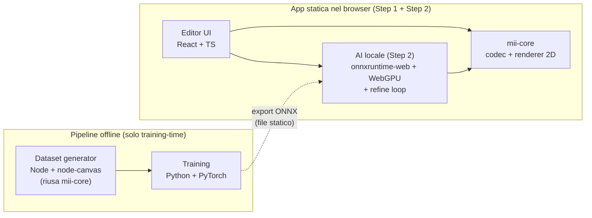

# Piano di sviluppo — Mii Builder e integrazione AI

Documento di pianificazione per costruire prima un **editor di Mii Wii** (Step 1) e poi l'**integrazione AI foto → Mii** (Step 2, futuro).

- **Data:** 2026-09-17
- **Riferimenti:** `MII_FORMAT_RESEARCH.md` (formato, CRC, asset, tabelle), `assets/` (sprite 2D completi, asset FFL 3D parziali)
- **Stato attuale del repo:** ricerca completata e validata, campioni (`sgango.mii`, `mii_000.rsd`), asset estratti, **zero codice applicativo**
- **Decisioni già prese:**
  1. Step 1 = builder dei Mii, senza backend a runtime
  2. Step 2 = AI, inferenza **on-device** con modello dedicato addestrato offline
  3. Renderer **2D-first** (sprite pack completo); 3D FFL in seguito
  4. Privacy: la foto dell'utente non lascia mai il dispositivo

---

## Indice

1. [Architettura complessiva](#1-architettura-complessiva)
2. [Stack tecnologico e motivazioni](#2-stack-tecnologico-e-motivazioni)
3. [Step 1 — Mii Builder](#3-step-1--mii-builder)
4. [Step 2 — Integrazione AI (futuro)](#4-step-2--integrazione-ai-futuro)
5. [Privacy, licenze e note legali](#5-privacy-licenze-e-note-legali)
6. [Decisioni aperte](#6-decisioni-aperte)
7. [Appendice A — Contratti e schemi](#appendice-a--contratti-e-schemi)

---

## 1. Architettura complessiva



Principi guida:

- **Single source of truth**: codec, tabelle e renderer vivono una volta sola in `mii-core` (TS). La pipeline dataset li riusa via Node; il training consuma solo dati renderizzati.
- **Golden fixtures**: `sgango.mii` e `mii_000.rsd` + vettori CRC sono la verità di riferimento per ogni test (round-trip byte-perfect).
- **Offline e statico**: l'app funziona senza rete. Nessun server, nessun database, nessun upload.
- **Seam per il futuro**: interfaccia `MiiPredictor` con implementazione locale; un eventuale fallback cloud (VLM) si innesta senza rifattorizzare l'app.
- **Non ora**: backend a runtime, SSR, autenticazione, persistenza remota, renderer 3D, supporto formati Switch/3DS.

---

## 2. Stack tecnologico e motivazioni

| Livello | Scelta | Motivazione |
|---|---|---|
| Frontend | **Vite + React + TypeScript** | SPA pura, zero SSR, build statica; TS obbligatorio per il codec bit-level |
| Rendering editor | **Canvas 2D** | Compositing di sprite con transform, tint e cache; nessun WebGL necessario per lo Step 1 |
| Stato editor | **Zustand** (o reducer puro) | Modello piatto (~30 campi), undo/redo a snapshot banali |
| Test | **Vitest** | Golden test codec, snapshot renderer, test UI in ambiente unico |
| AI inferenza (Step 2) | **onnxruntime-web** (WebGPU, fallback WASM) in Web Worker | On-device, privacy, nessun costo server; WebGPU in fallback degradato dove assente |
| Dataset generator (Step 2) | **Node + node-canvas** | Riutilizza *lo stesso* codice compositor del browser: nessuna seconda implementazione da mantenere allineata |
| Training (Step 2) | **Python + PyTorch** (offline, Colab/cloud) | Ecosistema ML; non è un servizio, è tooling da eseguire a mano |
| Package manager / repo | **pnpm workspaces** (alternativa: npm workspaces) | Monorepo con `apps/*` e `packages/*` |
| Hosting (facoltativo) | Statico: GitHub Pages / Netlify / Vercel | Solo file; nessun runtime server |

**Perché non un backend a runtime:** un Mii è una struttura di 74–76 byte e l'inferenza AI è on-device. Un server aggiungerebbe latenza all'anteprima live, costi, e la necessità di caricare foto personali su infrastruttura terza — tutto evitabile.

---

## 3. Step 1 — Mii Builder

### 3.1 Obiettivi

Un editor completo che permetta di:

1. **Importare** un file `.mii`/`.rsd` (74/76 byte), decodificarlo e mostrarne l'anteprima 2D.
2. **Modificare** ogni campo del formato Wii (viso, capelli, occhi, ecc.) con anteprima live.
3. **Creare** un Mii da zero partendo da un template.
4. **Esportare** `.mii` (RCD, 74 byte) e `.rsd` (76 byte, CRC rigenerato) pronti per l'uso su console/emulatori.
5. **Salvare/riaprire** il progetto in JSON (schema versionato) e autosalvataggio in `localStorage`.

### 3.2 Struttura del repo (target)

```
mii_study_cases/
├─ docs/
│  ├─ MII_FORMAT_RESEARCH.md       (formato, CRC, asset, tabelle)
│  ├─ MII_BUILDER_PLAN.md          ← questo documento
│  └─ MII_AI_PLAN.md               (Step 2) piano del modello foto → Mii
├─ package.json                    (workspaces, scripts)
├─ pnpm-workspace.yaml
├─ .gitignore                      (assets/, node_modules, dist, ...)
├─ sgango.mii
├─ assets/                         (NON tracciato — asset Nintendo)
│  ├─ renderMii_sprites/           sprite pack 2D (completo)
│  ├─ ffl/ ffl_archive/ tools/     pipeline 3D (futuro)
├─ apps/
│  └─ web/
│     ├─ labeler.html              (Step 2) pagina di labeling, fuori dalla build prod
│     ├─ public/
│     │  ├─ sprites/               copie degli sprite necessari (sync script)
│     │  └─ models/                ONNX (Step 2, vuoto ora)
│     └─ src/
│        ├─ app/                   routing, layout
│        ├─ editor/                pannelli, controlli, preview
│        ├─ labeler/               (Step 2) mini-app di labeling del golden set
│        ├─ ai/                    (Step 2) predictor, worker
│        └─ lib/                   store, persistenza, file I/O
├─ packages/
│  └─ mii-core/
│     ├─ src/
│     │  ├─ codec/                 bitReader, bitWriter, decode, encode, crc, types
│     │  ├─ tables/                hair, eyes, colors, layers, validità per sesso
│     │  ├─ render/                compositor, atlas, tint, anchors
│     │  └─ catalog/               features.json (generato)
│     └─ test/
│        └─ fixtures/
│           ├─ sgango.mii
│           ├─ mii_000.rsd
│           └─ expected.json        (decodifica attesa di entrambi)
├─ training/                       (Step 2) pipeline Python; gold_pairs/ = golden set
└─ tools/
   ├─ sync-assets/                 copia sprite selezionati in apps/web/public
   ├─ gen-catalog/                 genera features.json + contact sheet
   └─ dataset/                     (Step 2) generazione dataset + validator golden set
```

### 3.3 `mii-core` — Codec

Porting dell'Appendice B di `MII_FORMAT_RESEARCH.md` in TypeScript, con **preservazione dei bit riservati** (requisito: round-trip byte-perfect, cfr. §10 pitfalls della ricerca).

```ts
// packages/mii-core/src/codec/types.ts
export interface MiiData {
  // anagrafica
  name: string;            // max 10 code unit UTF-16
  creatorName: string;     // max 10 code unit UTF-16
  sex: 0 | 1;
  month: number;           // 0–12 (0 = non impostato)
  day: number;             // 0–31 (0 = non impostato)
  favColor: number;        // 0–11
  favorite: 0 | 1;
  height: number;          // 0–127
  build: number;           // 0–127
  // identità
  miiType: number;         // 4 bit alti dell'ID (pantaloni)
  creationTicks: number;   // 28 bit (4 s dal 2006-01-01 UTC)
  consoleId: Uint8Array;   // 4 byte, preservato
  // testa
  faceType: number;        // 0–7
  skinTone: number;        // 0–5
  facialFeature: number;   // 0–11 (rughe/trucco)
  mingle: 0 | 1;
  downloaded: 0 | 1;
  hair:       { type: number; color: number; flip: 0 | 1 };
  eyebrow:    { type: number; rotation: number; color: number; size: number; x: number; y: number };
  eye:        { type: number; rotation: number; color: number; size: number; x: number; y: number };
  nose:       { type: number; size: number; y: number };
  mouth:      { type: number; color: number; size: number; y: number };
  glasses:    { type: number; color: number; size: number; y: number };
  facialHair: { mustache: number; beard: number; color: number; size: number; y: number };
  mole:       { enabled: 0 | 1; size: number; x: number; y: number };
  // bit riservati: MAI azzerati, trasportati così come sono
  reserved: {
    personal: number; head: number[]; hair: number; eyebrow: number[];
    eye: number[]; nose: number; glasses: number; mole: number;
  };
}

export function decode(bytes: Uint8Array): MiiData;          // RCD 74B o RSD 76B
export function encode(mii: MiiData): Uint8Array;            // sempre RCD 74B
export function toRsd(mii: MiiData): Uint8Array;             // 74B + CRC big-endian
export function miiCrc16(data: Uint8Array): number;          // CRC-16/CCITT + 16 bit di augment
export function validate(mii: MiiData): ValidationIssue[];   // range, UTF-16, vincoli per sesso
```

Regole di implementazione (dalla ricerca):

- Lettura/scrittura **MSB-first** dentro parole big-endian; `BitWriter` speculare a `BitReader`.
- Scrittura sempre per **parola intera** (16/32 bit), mai patch byte per byte.
- I bit riservati osservati non-nulli (es. Saburo: `unknown_2=7`, `unknown_6=15`, `unknown_9=9`, `unknown_12=1`) vengono preservati.
- Un file è valido come RSD se `miiCrc16(intero file) === 0`; per `sgango.mii` il CRC dei primi 74 byte è `0xC954`.
- Import: rilevare per dimensione **e** contenuto, non per estensione (`.mii` è ambiguo; un file CHARINFO da 88 byte va rifiutato con messaggio chiaro).

### 3.4 `mii-core` — Tabelle e catalogo

Tre fonti di dati, da trascrivere e validare nella milestone M2:

1. **Tabelle di rendering** (da `MII_FORMAT_RESEARCH.md` §13.1, a sua volta da WiiBrew):
   - lookup array `hairfg[72]`, `hairbg[72]`, `eyebrows[24]`, `eyes[48]`, `noses[12]`, `lips[24]`;
   - palette colori (`haircol`, `eyecol`, `lipcol`, colori occhiali, ecc.);
   - ancore, step di scala/posizione e **ordine dei 12 layer** (trascrizione da WiiBrew, validazione visiva).
2. **Vincoli di validità per sesso** (lista indici ammessi per capelli/sopracciglia/occhi/naso/bocca, dipendenze rotazione↔tipo): da WiiBrew + confronto con My Avatar Editor. Servono sia all'editor (per non proporre opzioni non valide) sia al generatore di dataset.
3. **`features.json` generato** (`tools/gen-catalog`): mappa `indice → { sheet, tile, rect, palette }` per ogni feature. Usato dal renderer, dai tool di contatto, e in futuro dai prompt/cataloghi per modelli VLM. Formato in Appendice A.

### 3.5 `mii-core` — Renderer 2D

Compositor Canvas 2D che, dato `MiiData`, disegna le sprite nell'ordine di layer corretto.

- **Atlas**: caricamento lazy dei PNG (`mii_hairs1/2`, `mii_eyes1/2/3`, `mii_eyebrows`, `mii_noses`, `mii_lips`, `mii_glasses`, `mii_beards`, `mii_mustache`, `mii_features`, `mii_heads`, `mii_mole`) con rect calcolati da `features.json`.
- **Tint**: gli sprite dei capelli/peli sono in scala di grigi e tinti con la palette; gli occhi hanno 3 layer (bianco/iride/pupilla) tinti separatamente. Implementazione: canvas offscreen + `globalCompositeOperation`, con **cache** per coppia (sheet, colore).
- **Transform**: scala e posizione secondo gli step documentati; rotazione dove prevista (sopracciglia, ecc.).
- **API**:
  ```ts
  export function renderMii(ctx: CanvasRenderingContext2D, mii: MiiData, opts?: {
    size?: number;          // dimensione canvas logica
    background?: string | null;
    atlas?: SpriteAtlas;    // iniettabile (browser fetch / node-canvas fs)
  }): void;
  ```
  L'`atlas` iniettabile è il punto che permette a `tools/dataset` di usare lo stesso renderer in Node.
- **Validazione visiva**: confronto con render di riferimento (My Avatar Editor / mii2png) per i due campioni — almeno controllo manuale documentato, poi snapshot test.

### 3.6 Editor UI

**Layout**: preview grande a sinistra (canvas, sfondo a scelta), pannello controlli a destra con sezioni accurate; barra superiore con nome, import/export, undo/redo, randomize.

| Sezione | Campi | Controlli |
|---|---|---|
| Dati personali | nome, nome creatore, sesso, compleanno, colore preferito, preferito | input testo (max 10), select, griglia colori |
| Corpo | altezza, corporatura | slider 0–127 |
| Viso | forma, carnagione, rughe/trucco | griglia di thumbnail sprite + select |
| Capelli | tipo (fino a 72, filtrato per sesso), colore, flip | griglia paginata |
| Sopracciglia | tipo, rotazione, colore, dimensione, X, Y | griglia + slider |
| Occhi | tipo, rotazione, colore, dimensione, X, Y | griglia + slider |
| Naso | tipo, dimensione, Y | griglia + slider |
| Bocca | tipo, colore labbra, dimensione, Y | griglia + slider |
| Occhiali | tipo, colore, dimensione, Y | griglia + slider |
| Peli facciali | baffi, barba, colore, dimensione, Y | griglia + slider |
| Neo | on/off, dimensione, X, Y | toggle + slider |
| Info | tipo Mii (colore pantaloni), data creazione, console ID | sola lettura; "rigenera ID" per nuovi Mii |

Comportamenti:

- **Anteprima live** a ogni modifica; rendering in `requestAnimationFrame` con throttle.
- **Undo/redo** a snapshot (`structuredClone` del `MiiData`, stack limitato a ~100).
- **Randomize** che rispetta i vincoli per sesso (stesso sampler del dataset AI: un solo algoritmo).
- **Import**: drag&drop + file picker; messaggi d'errore espliciti (dimensione/CRC/range non validi).
- **Export**: `.mii` e `.rsd` via Blob download; nome file derivato dal nome Mii.
- **Autosalvataggio** in `localStorage` (stato + impostazioni UI); "nuovo Mii" parte da un template con bit riservati noti e ID generato (tipo normale + tick correnti).
- **Solo tastiera**: navigazione tra opzioni con frecce (stile console), scorciatoie undo/redo.
- UI in italiano, predisposta per i18n (stringhe isolate).

### 3.7 Milestone Step 1

| # | Milestone | Deliverable | Definition of Done |
|---|---|---|---|
| **M0** | Scaffold | Monorepo pnpm, Vite+React+TS, Vitest, ESLint/Prettier, `.gitignore` (assets esclusi), script `sync-assets` | `pnpm test` e `pnpm dev` funzionano a vuoto; gli asset non sono tracciati |
| **M1** | Codec | `mii-core/codec` completo + fixtures + golden test | Round-trip byte-identical su `sgango.mii` e `mii_000.rsd`; CRC `0xC954`; RSD valido; decodifica === `expected.json` |
| **M2** | Renderer | Atlas, tabelle, tint, compositor + catalog generator | `sgango.mii` e Saburo renderizzati e confrontati a vista con un riferimento; snapshot test attivi |
| **M3** | Editor | UI completa, preview live, undo/redo, randomize, validazione | Ogni campo modificabile; modificare e ripristinare un campo produce file identico all'originale |
| **M4** | I/O e persistenza | Import `.mii`/`.rsd`, export entrambi, salvataggio JSON, autosave, nuovo Mii | File esportato reimportabile senza perdite; RSD supera il check CRC (`crc16(full) === 0`) |
| **M5** | Polish e rilascio | Tastiera, accessibilità, responsive, README, build statica | Build di produzione < ~1 MB JS gzip (senza sprite); funziona offline |

Stima indicativa (part-time): M0–M1 ~3–5 giorni, M2 ~3–5 giorni, M3 ~5–8 giorni, M4 ~2–3 giorni, M5 ~2–3 giorni.

### 3.8 Strategia di test (Step 1)

- **Codec**: golden fixtures; property test (decode→encode→decode stabile); fuzz leggero sui range; casi limite (nome 10 caratteri, campo vuoto, bit riservati non-nulli).
- **Renderer**: snapshot PNG per un set di Mii fissi (default maschile/femminile, `sgango`, Saburo, un Mii con occhiali+barba+neo); test della cache tint.
- **UI**: test di integrazione leggeri (modifica campo → export). E2E Playwright solo se/quando serve.
- **Regressione asset**: `sync-assets` verifica gli SHA-256 annotati in `MII_FORMAT_RESEARCH.md` §13.

### 3.9 Rischi Step 1

| Rischio | Impatto | Mitigazione |
|---|---|---|
| Ordine layer/ancore trascritti male | Render sbagliato | Confronto visivo con render di riferimento in M2, prima della UI |
| Vincoli per sesso incompleti | Opzioni non valide in editor/dataset | Trascrizione + verifica incrociata con My Avatar Editor; test dedicati |
| `.mii` ambiguo (RCD vs CHARINFO) | Import errato | Rilevamento per dimensione+contenuto, messaggio esplicito |
| Asset Nintendo non ridistribuibili | Problema legale se si pubblica | `assets/` gitignored; valutare deploy pubblico senza sprite o con asset forniti dall'utente (vedi §5) |
| Sprite mancanti per qualche indice | Buchi nel render | Verifica copertura 0–N per ogni tabella in M2 (dal §13.1 della ricerca risultano completi) |

---

## 4. Step 2 — Integrazione AI (futuro)

### 4.1 Obiettivo

Nell'editor, un pulsante **"Crea da foto"**: l'utente carica un ritratto, un modello **locale** predice i parametri del Mii, l'editor si precompila e l'utente rifinisce. La foto **non viene mai caricata** su un server.

Pipeline complessiva:

```
foto → crop volto → modello ONNX (multi-head) → MiiData iniziale → refine loop (render vs foto)
     → MiiData finale → precompila editor → l'utente rifinisce → export .mii
```

### 4.2 Generazione dataset (Node, offline)

`tools/dataset` riusa **lo stesso compositor** di `mii-core` tramite `node-canvas` (l'API Canvas 2D è compatibile; l'atlas è iniettabile per questo motivo).

- **Campionamento parametri**: sampler vincolato unico (condiviso con il randomize dell'editor) — range validi per campo (ricerca §3.1) + vincoli per sesso + dipendenze rotazione↔tipo. Mix di: (a) campionamento uniforme (classi bilanciate), (b) campionamento dalla distribuzione dei Mii reali dell'archivio MiiDataFiles (realismo statistico).
- **Output per campione**: render RGBA 256×256 (sfondo trasparente) + record `params.jsonl`. I render base sono "puliti"; sfondo e augmentation si applicano **nel dataloader** in training, non su disco.
- **Augmentation** (preserva le feature, non le occlude): compositing su sfondi casuali (tinta unita, gradiente, poi anche foto), rotazione ±10°, scala 0.9–1.1, jitter di luminosità/contrasto/saturazione, rumore gaussiano, compressione JPEG, leggera prospettiva.
- **Scala**: target 100k–300k render (≈10–30 GB a 256 px); shard in più cartelle/ZIP. Split **per Mii**, mai per immagine.
- **Riproducibilità**: seed configurabile, versione del sampler nel manifest.

### 4.3 Training (PyTorch, offline)

- **Backbone**: transfer learning da un modello pretrained (candidati: MobileNetV3-Large, EfficientNet-Lite0, ViT-tiny; alternativa robusta al domain gap: DINOv2-small). Input 224–256 px.
- **Teste**: una testa di **classificazione per ogni campo discreto** (sex, month, day, favColor, favorite, face, skin, wrinkles, hair type/color/flip, eyebrow type/rotation/color, eye type/rotation/color, nose, mouth type/color, glasses type/color, mustache, beard, facialHair color, mole) + **regressione** per i continui (height, build, size, x/y). Mascheramento dei logit non validi per sesso a inference.
- **Loss**: cross-entropy pesata per testa + SmoothL1 per le regressioni; pesi da tarare sulle metriche end-to-end.
- **Metriche**: top-1/top-3 per testa, exact-match medio, e **metrica end-to-end**: distanza di embedding tra render della predizione e render ground truth (e, su foto reali, tra render e foto).
- **Baseline**: (a) costante modale, (b) predittore euristico (landmark + colore pelle/capelli), (c) prototipo VLM zero-shot opzionale per confronto. Servono a capire quando il modello "vale".
- **Hardware**: Colab/cloud (T4/L4 sufficienti per backbone piccoli); 100k immagini ≈ decine di epoche in poche ore.
- **Artefatti**: checkpoint, config, log metriche, ONNX.

### 4.4 Export e inferenza on-device

- Export **ONNX** (opset ≥ 17, batch dinamico), quantizzazione int8 o fp16; target **< 20 MB**.
- Inferenza in **Web Worker** con `onnxruntime-web`: `webgpu` EP con fallback `wasm` (SIMD). Preprocessing: crop volto (MediaPipe Face Detector, ~2 MB WASM) o crop centrale con margine; resize 256; normalizzazione.
- Lazy load: il modello si scarica **solo** quando l'utente preme "Crea da foto".
- Risultato → `MiiData` → precompila l'editor. Interfaccia stabile:
  ```ts
  export interface MiiPredictor {
    predict(photo: ImageBitmap): Promise<{ mii: Partial<MiiData>; confidence: Record<string, number> }>;
  }
  export class LocalOnnxPredictor implements MiiPredictor { /* Step 2 */ }
  export class RemoteVlmPredictor implements MiiPredictor { /* fallback opzionale, opt-in */ }
  ```

### 4.5 Refine loop (il pezzo che chiude il "perfect match")

Il modello dà l'inizializzazione; il domain gap render-cartoon ↔ foto reale si colma ottimizzando.

- **Obiettivo**: similarità tra render candidato e foto. Opzioni, in ordine di costo:
  1. **Embedding del backbone del predittore** applicato a render e foto (nessun modello extra);
  2. **MobileCLIP/CLIP** via `transformers.js`, se la similarità (1) è troppo debole.
- **Ricerca**: coordinate descent / hill-climbing sui campi, partendo dalla predizione; ~200–500 valutazioni (ogni valutazione = 1 render ~5–15 ms + 1 embedding ~10–30 ms → pochi secondi). Barra di progresso e stop manuale; si tiene il migliore.
- Campi continui (posizioni, dimensioni, altezza/corporatura) sono i più adatti al refine; i campi semantici (tipo capelli/occhi/bocca) restano guidati dal modello e dalla rifinitura manuale.

### 4.6 Renderer 3D FFL (futuro remoto)

- Serve una **tabella di mapping Wii→FFL** (indice feature Wii → shape/texture FFL) che **non esiste** ancora: è il prerequisito principale. Gli asset estratti sono parziali (658 mesh dall'unione dei due archivi, alcuni slot solo su console).
- Beneficio: render 3D più realistici → minor domain gap sia per il training sia per l'anteprima.
- Piano: prima la tabella + Three.js per l'anteprima, poi eventuale dataset 3D.

### 4.7 Milestone Step 2

| # | Milestone | Deliverable | Definition of Done |
|---|---|---|---|
| **F1** | Cataloghi | `features.json` definitivo + contact sheet per feature indicizzate | Ogni indice ha thumbnail; usabile anche come prompt per modelli VLM |
| **F2** | Dataset | `tools/dataset` + 10k campioni di prova | Render Node identici a quelli browser (test di parità); sampler vincolato coperto da test |
| **F3** | Baseline | Predittore euristico (landmark+colori) integrato via `MiiPredictor` | "Crea da foto" end-to-end funzionante senza modello ML |
| **F4** | Training | Checkpoint + report metriche | Metriche per testa sopra baseline modale; export ONNX < 20 MB |
| **F5** | Inferenza | `LocalOnnxPredictor` in Web Worker | Predizione in < ~2 s su WebGPU; fallback WASM funzionante |
| **F6** | Refine | Loop di ottimizzazione on-device | Miglioramento misurabile della similarità render↔foto vs predizione grezza |

### 4.8 Rischi Step 2

| Rischio | Impatto | Mitigazione |
|---|---|---|
| Domain gap cartoon ↔ foto | Match scarso | Backbone pretrained, augmentation pesante, refine loop, valutazione su foto reali fin da subito |
| Label sintetiche ≠ gusto umano | Risultati "giusti" ma poco somiglianti | Human eval nell'editor + metrica end-to-end via embedding |
| WebGPU non disponibile | Lentezza | Fallback WASM; modello piccolo; worker |
| Peso modello | Download iniziale | Lazy load, < 20 MB, cache CDN/browser |
| Overfitting sui render | Scarsa generalizzazione | Split per Mii, augmentation, dati reali solo in eval (foto senza ground truth) |

---

## 5. Privacy, licenze e note legali

- **Foto**: elaborata solo in memoria nel browser; nessun upload, nessuna persistenza di default. Se in futuro si vorrà usare foto utente per il training, servirà consenso esplicito e opt-in separato.
- **Asset Nintendo**: sprite e asset FFL sono IP Nintendo. Restano **fuori dal repo** (`.gitignore`). Per un deploy pubblico valutare: (a) non distribuire gli sprite, (b) asset forniti dall'utente, o (c) valutare il rischio consapevolmente come fanno i progetti fan (es. My Avatar Editor). Da decidere prima del deploy.
- **Disclaimer**: progetto amatoriale, non affiliato a Nintendo. I file `.mii`/`.rsd` sono dati dell'utente, non software Nintendo.

---

## 6. Decisioni aperte

| # | Decisione | Opzioni | Default proposto |
|---|---|---|---|
| D1 | Package manager | pnpm / npm workspaces | pnpm |
| D2 | Training hardware | Colab/cloud / GPU locale | Da definire in F4 (Colab se non c'è GPU) |
| D3 | Deploy pubblico Step 1 | Locale / statico pubblico | Locale finché D4 non è risolta |
| D4 | Asset nel deploy | Inclusi / utente-provided / esclusi | Da decidere prima del deploy |
| D5 | Formati extra | CHARINFO (Switch) / 3DS-Wii U / solo Wii | Solo Wii nello Step 1 |
| D6 | Obiettivo "match" | Upset editor precompilato (utente rifinisce) / match automatico perfetto | Precompilato + refine; il match perfetto è obiettivo di ricerca |

---

## Appendice A — Contratti e schemi

### A.1 Progetto JSON (salvataggio editor)

```json
{
  "schemaVersion": 1,
  "createdAt": "2026-09-17T10:00:00Z",
  "modifiedAt": "2026-09-17T10:05:00Z",
  "mii": { "...": "MiiData serializzato (Uint8Array → hex)" }
}
```

### A.2 `features.json` (generato da `tools/gen-catalog`)

```json
{
  "version": 1,
  "source": { "spritePack": "renderMii_sprites", "sha256Prefix": "46320237A2E8AAFD..." },
  "sheets": {
    "hairs1": { "file": "mii_hairs1.png", "size": [960, 840], "tile": [120, 120], "count": 56 }
  },
  "features": {
    "hair": [
      { "index": 0,  "foreground": { "sheet": "hairs2", "tile": 3 },  "background": { "sheet": "hairs1", "tile": 42 } },
      { "index": 50, "foreground": { "sheet": "hairs1", "tile": 19 }, "background": { "sheet": "hairs1", "tile": 18 } }
    ],
    "eye": [ { "index": 43, "layers": ["whites", "iris", "pupil"], "tint": ["iris"] } ]
  }
}
```

Nota: i valori `hair` sono reali, calcolati con le regole `hairfg`/`hairbg` del §13.1 della ricerca (tile ≥ 56 → sheet `hairs2`, indice − 56). La mappatura `eye` sheet/layer va confermata in M2 sul confronto visivo.

### A.3 Record dataset (una riga di `params.jsonl`)

```json
{
  "id": "000012345",
  "file": "shard-000/shard-000-12345.png",
  "samplerVersion": 1,
  "seed": 42,
  "mii": { "...": "MiiData completo, inclusi i bit riservati campionati" }
}
```

### A.4 Definizione di "fatto" per lo Step 1 (riassunto)

1. Round-trip byte-perfect su entrambe le fixture.
2. Export RSD verificato (`miiCrc16(full) === 0`).
3. Renderer validato a vista su `sgango` e Saburo.
4. Editor completo su tutti i campi, con undo/redo e vincoli per sesso.
5. App statica, offline, senza rete.
